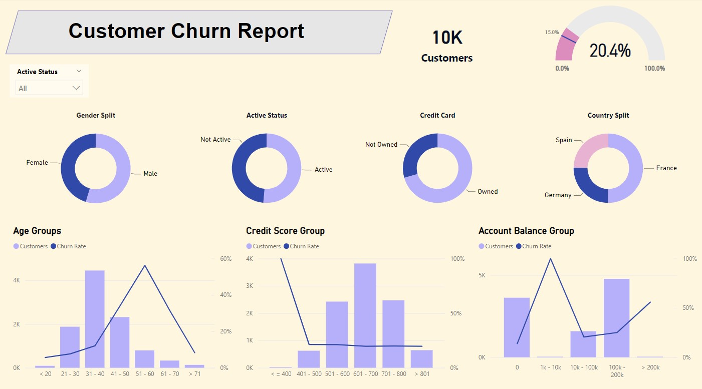
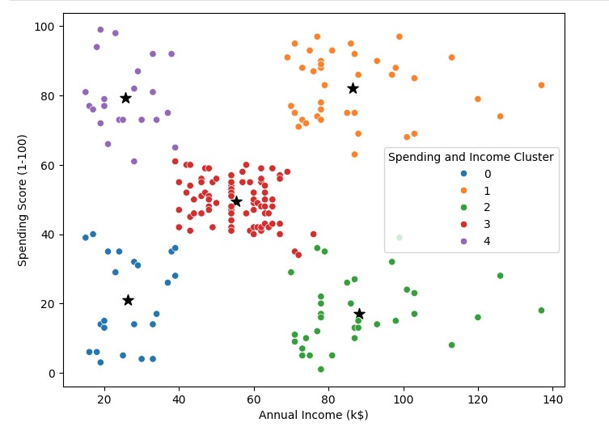

# Portfolio Projects

### Project 1: Churn Analysis / Power BI 

Project Goal: To create a report in Power BI that the user could interact with in order to gain insights around churn rates for customers.

Key Insights:  
- German customers with a much higher churn rate than Spain and France (32% vs 16% avg )
- Female Customers with a higher churn rate than men (25% vs 17%)
- Positive relationship between Age and Churn rate, with a notable spike from around 50-60 yrs
- No notable relationship between Credit score and churn rates
- Low savings and very high savings showed high churn rates vs low for those with average savings.

Dataset: Bank Customers

Tools: Power BI

### Project 2: Customer Segmentation / Python

Project Goal: To run a clustering algorthim on the dataset to see whether or not there is any clear segmentation of customers.  Average income and Score Rating were chosen as the two fields.
Clusters would be reviewed and marketing advice would be given. 

Key Insights:  
- N Clusters was set to 6
- Clusers of note were 1, 2 and 4
- Cluster 1 was labelled as 'High earner/High Spend'.  Recommendation of high ticket items and high frequency of marketing.
- Cluster 2 was labelled as 'High earner/Low Spend'.  Potential opportunity to convert these into cluster 1.  Further analysis required - Recommendation to look at other differences between cluster 1 and 2 (Gender,Age, Products)
- Cluster 4 was labelled as 'Low earner/High Spend'.  Recommendation of discounts/sale items as well as limited time offers.

Dataset: Mall Customers

Tools: Python, K-means Clustering

### Project 3: HR Analysis / SQL / Power BI

Project Goal 1: To create a database for the client which would include data from 3 seperate CSV files.  Query the database to complete the following tasks for the client: 1 - Find a list of the 'heathiest' associates, 2 - Caluculate the max cash pay increase that can be rewarded to associates based on the current budget of the client.

Project Goal 2: Create a data link between the database and Power BI + Create a Dashboard that would enable the user to review key KPI's and trends across the dataset with the ability to filter by season.

Key Insights:  
Goal 1 questions: List of 111 associates identified as 'heathiest' based on a set of critera agreed with client.  List of assoicate IDs sent back to client. Max cash pay increase for the year per associate calculated to be $1,414

Goal 2 - Dashboard handed over to client, analysis not required.

Dataset: HR Data

Tools: SQL, Power BI

