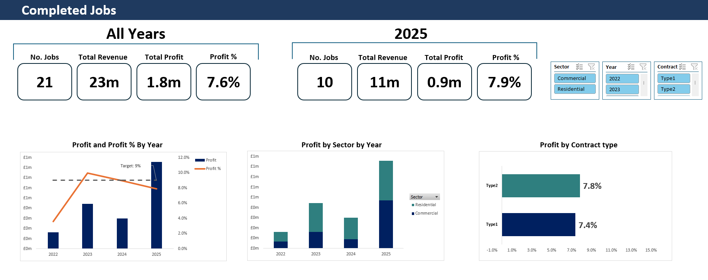
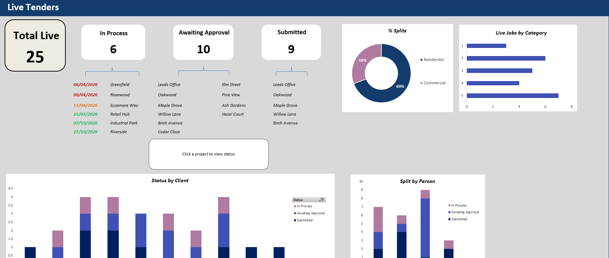
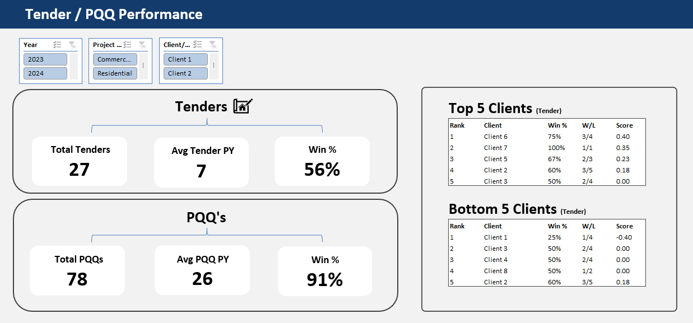
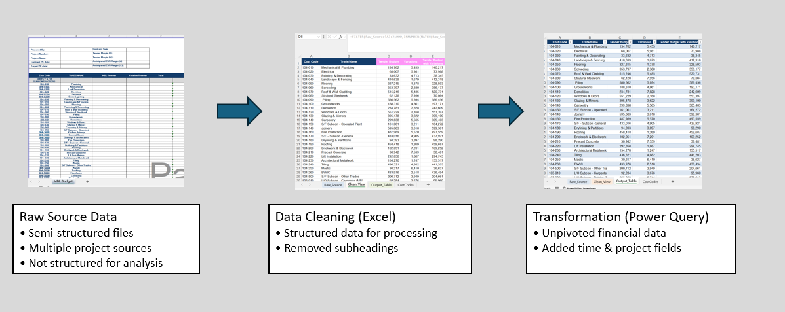
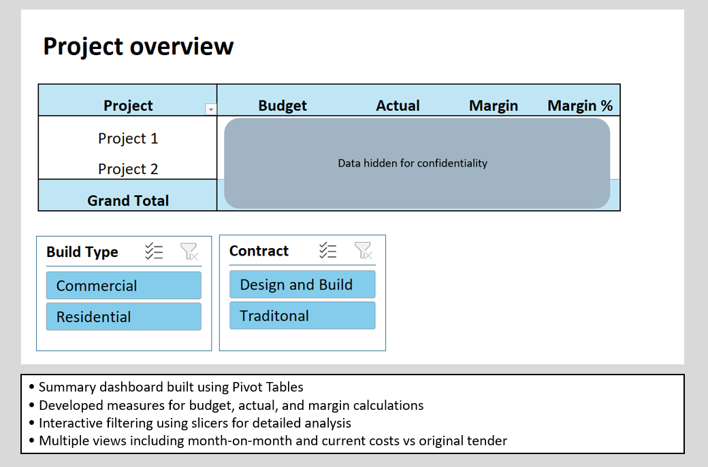

# Portfolio

## James Nugent  
**Data & Finance Analyst**

Data & Finance Analyst with 16+ years of experience delivering reporting, automation, and insight to support business performance. Skilled in turning complex data into structured models, dashboards, and practical decision-support tools using Excel, Power BI, Python, and SQL.

---

## 📊 BI / Reporting

### 📈 Project 1: Completed Jobs Dashboard (Excel)

**Goal:**  
Consolidate completed project data into a single dashboard to enable performance to be reviewed at both an overall and detailed level, with the ability to filter by sector and contract type.

**Overview:**  
Designed and developed a dashboard to track financial performance across completed projects for a construction business, combining multiple data sources into a structured model. The dashboard provides a clear view of revenue, profit, and margin trends, with both full-year and current-year KPI summaries.

**Key Features:**
- KPI summary for total jobs, revenue, profit, and profit margin (All Years vs Current Year)
- Profit % tracked against a defined performance target
- Breakdown of performance by sector (Commercial vs Residential)
- Comparison of contract types (Design & Build vs Traditional)
- Interactive filtering using slicers for detailed analysis

**Insight Example:**
- Early analysis shows a significant difference in profitability between contract types, with one delivering nearly double the margin of the other—contrary to initial business expectations.

---

*Note: Data shown has been anonymised and adjusted for portfolio purposes. Insights are representative of real-world analysis but may not exactly match the displayed figures.*

---

### ⚙️ Project 2: Tender Pipeline & Performance Dashboard (Excel)

**Goal:**  
Enhance an existing tender tracking dashboard to improve visibility of live opportunities, highlight risks, and enable more structured analysis of tender performance over time.

**Overview:**  
Originally built using SUMIF-based calculations, the solution was redesigned into a more robust and scalable data model using structured tables and pivot tables. Developed for a construction business, the dashboard was split into two focused views: a live pipeline dashboard for monitoring current tenders and identifying risks, and a historical dashboard to analyse performance trends and outcomes.

**Key Features:**
- Transition from formula-based reporting to a structured data model using pivot tables  
- Data cleansing to address inconsistencies, blanks, and formatting issues  
- Separate dashboards for live tenders and historical performance  
- Interactive filtering by sector, client, and year  
- Automated updates through structured data inputs and refreshable dashboards  
- Improved VBA process to append new records correctly to the data table (ensuring data integrity and consistency)  
- Live pipeline ordered by tender deadline, with conditional formatting (RAG status) to highlight approaching or overdue submissions  
- Interactive element allowing users to select a project and dynamically display the latest comments from the underlying data (via VBA)  

**Insight Examples:**
- Identified a high-volume client with a 0% success rate across tenders, prompting consideration of bid strategy and resource allocation.  
- PQQ (Pre-Qualification Questionnaire) success rates are high overall but show a declining trend over the past three years, indicating a potential shift in competitiveness or client requirements.  
- A large proportion of live tenders are currently ranked lowest (5/5) in terms of strategic priority, suggesting potential inefficiencies in resource allocation and raising the question of whether time is being invested in low-value opportunities.  

---

**Live Tender Pipeline**

---

**Historical Performance Dashboard**

*Note: Data shown has been anonymised and adjusted for portfolio purposes. Insights are representative of real-world analysis but may not exactly match the displayed figures.*

---

## 🔄 Project 3: End-to-End Financial Data Model & Dashboard (Excel)

**Goal:**  
Consolidate multiple live project data files into a single dashboard to improve visibility of financial performance, enable structured analysis of budget vs actuals, and support comparison across projects, sectors, and contract types.

**Overview:**  
Originally working with semi-structured Excel files across multiple projects, the solution was redesigned into a structured and scalable data model using Excel tables, Power Query, and Pivot Tables.  

The process transforms raw source data into a clean, analysis-ready dataset, enabling consistent reporting of revenue, cost, and margin metrics. The final dashboard provides both high-level KPI summaries and detailed breakdowns, supported by interactive filtering.

**Key Features:**  
-- Transformation of semi-structured files into a structured data model  
- Data cleaning and standardisation for analysis  
- Power Query used to unpivot and reshape financial data  
- Consolidation of multiple project files into a unified dataset  
- Dashboard built using Pivot Tables with measures and interactive filtering

### Data Pipeline
  

### Final Dashboard Output
  

*Note: Data shown has been anonymised and adjusted for portfolio purposes. Insights are representative of real-world analysis but may not exactly match the displayed figures.*

